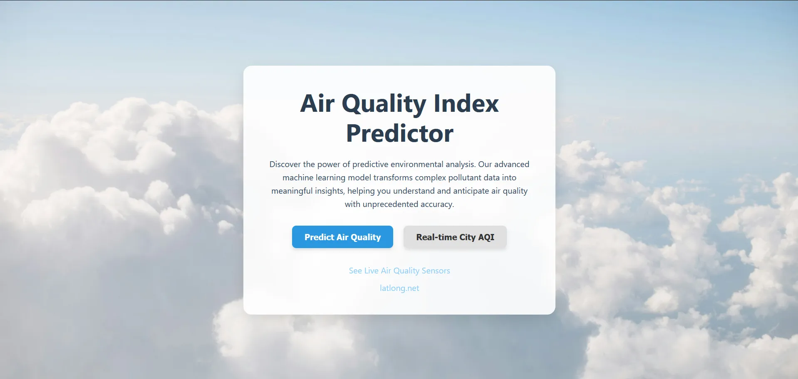
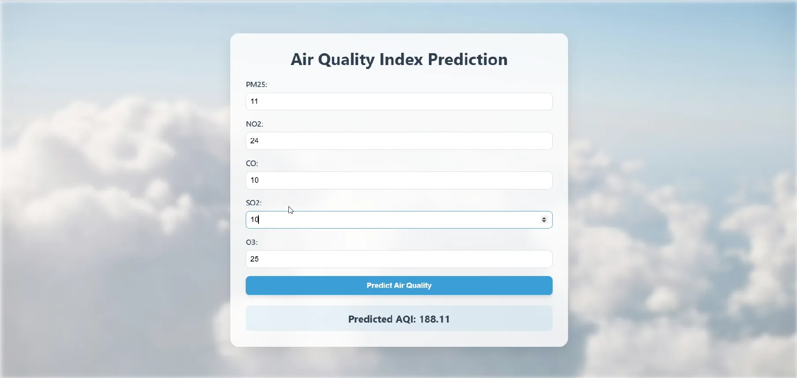
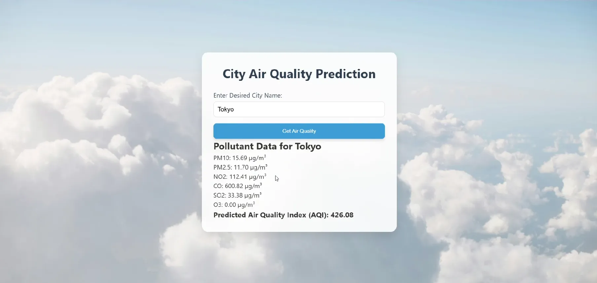

# 🌎 Airon — Real-Time Global AQI Predictor

Airon is a full-stack machine learning web app that predicts the Air Quality Index (AQI) of any country in real time. It fetches air pollutant data using OpenWeather APIs and makes predictions using a trained Random Forest model.

---

- See the video demo here: https://www.youtube.com/watch?v=WSw6QEVrFaE
- See the live demo here: https://farrfoxr.github.io/Airon/

---

## 📸 Demo

---

## 🚀 Features

- Real-time AQI prediction from global cities
- Interactive UI with React
- Integration with OpenWeather Air Quality & Geocoding API
- Model built using scikit-learn (Random Forest)
- End-to-end full-stack: data ingestion → prediction → visualization

---

## 🛠 Tech Stack

- **Frontend**: React, TypeScript, HTML/CSS
- **Backend**: Flask, Python, Postman
- **ML Libraries**: scikit-learn, pandas, matplotlib
- **APIs**: OpenWeather (Air Quality, Geocoding)

---

## 🧪 Getting Started

1. Clone this repository
2. Install backend dependencies with `pip install -r requirements.txt`
3. Set up your OpenWeather API key in `.env`
4. Run backend: `flask run`
5. Run frontend: `npm start` (from React folder)

---

## 📚 What I Learned

This project was a personal breakthrough. I transitioned from basic ML scripting to building a real-world full-stack application. I learned:

- How to connect APIs to ML workflows
- Fundamentals of REST APIs and using Flask for backend
- Frontend development with React and TypeScript
- How to structure a project from prototype to production

---

## 📎 License

MIT – feel free to use and build upon this!
